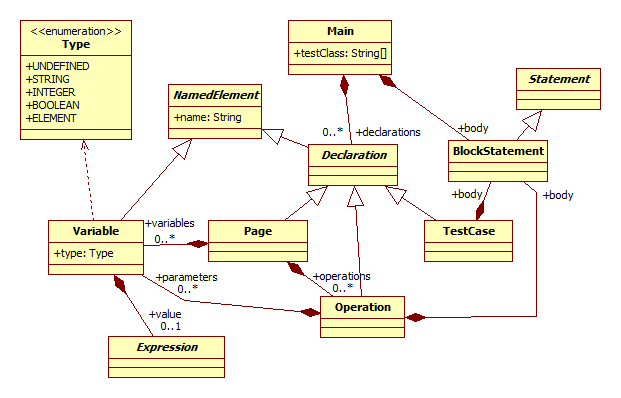
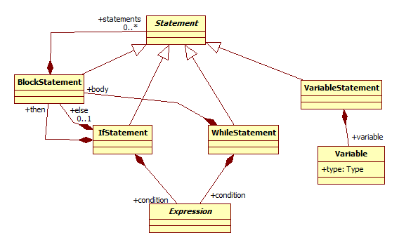
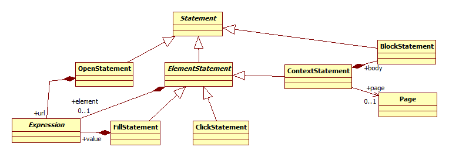
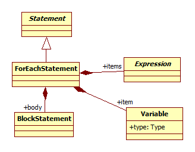
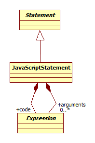

# WebTest meta-model

Since the meta-model of the [WebTest language](WebTestLanguageSpecification.md) consists of a lot of classes, it is split into multiple views for clarity. During the mapping to Xcore, you have to merge the various views into a single model.

The common part of the meta-model must be realized by everyone. From the extensions, you only have to implement the two extensions assigned to you. Of course, you can implement the other extensions, too, if you want to.

## Common part

The structure of the WebTest code is shown in the following view:



Control structures are shown in the following view:



Statements for HTML elements are shown in the following view:



Other general statements are shown in the following view:


Complex expressions are shown in the following view:


Simple expressions are shown in the following view:


## Extensions

The **Capture** extension is shown in the following view:


The **ForEach** extension is shown in the following view:



The **JavaScript** extension is shown in the following view:



The **Manual** extension is shown in the following view:


The **TestParams** extension is shown in the following view:


## The first common view in Xcore

To help you to start solving the task, we give you the Xcore representation of the first common view:

```Java
@GenModel(modelDirectory="webtest.model/src-gen", forceOverwrite="true", updateClasspath="false", complianceLevel="21.0")
package webtest.model

enum Type
{
    UNDEFINED,
    STRING,
    INTEGER,
    BOOLEAN,
    ELEMENT
}

class Main
{
    String[] testClass
    contains Declaration[] declarations
    contains BlockStatement body
}

abstract class NamedElement
{
    String name
}

abstract class Declaration extends NamedElement
{
}

class Variable extends NamedElement
{
    Type ^type
    contains Expression value
}

class Page extends Declaration
{
    contains Variable[] variables
    contains Operation[] operations
}

class Operation extends Declaration
{
    contains Variable[] parameters
    contains BlockStatement body
}

class TestCase extends Declaration
{
    contains BlockStatement body
}

abstract class Statement
{
}

class BlockStatement extends Statement
{
    contains Statement[] statements
}

abstract class Expression
{
} 
```

You have to finish this code to solve this part of the laboratory by incorporating the elements on the other views.

It is important, that the package name in the Xcore file must be **webtest.model**, and the annotation above it must be left as it is. Also, the names of the classes, properties and operations must be exactly the same as in the UML diagrams.
