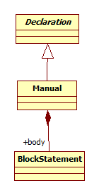

# WebTest metamodell

Mivel a [WebTest nyelv](WebTestLanguageSpecification.md) metamodellje nagyon sok osztályból áll, a könnyebb érthetőség kedvéért több nézetre szétdarabolva kerül bemutatásra. Az Xcore reprezentációra történő leképzés során a különböző nézeteken látható jelöléseket össze kell fésülni. Így alakul ki a metamodell végső teljes változata.

A metamodell közös részét mindenkinek meg kell valósítania. A bővítményekből mindenkinek csak a számára kiosztott 2 darab bővítményt kell beépítenie. (Természetesen, ha valaki szeretné, a többi bővítményt is beépítheti, de a kiosztott 2 darab bővítményt mindenképpen meg kell valósítani.)

## Közös rész

A WebTest kód szerkezetét az alábbi nézet mutatja be:


A vezérlési utasításokat alábbi nézet mutatja be:


A HTML elemekkel kapcsolatos utasításokat alábbi nézet mutatja be:


A egyéb általános utasításokat alábbi nézet mutatja be:


A bonyolultabb kifejezéseket alábbi nézet mutatja be:


Az egyszerűbb kifejezéseket alábbi nézet mutatja be:


## Bővítmények

A **Capture** nevű bővítményt az alábbi nézet mutatja be:


A **ForEach** nevű bővítményt az alábbi nézet mutatja be:


A **JavaScript** nevű bővítményt az alábbi nézet mutatja be:


A **Manual** nevű bővítményt az alábbi nézet mutatja be:



A **TestParams** nevű bővítményt az alábbi nézet mutatja be:


## Első közös nézet Xcore-ban

Segítségképpen megadjuk a WebTest metamodell legelső nézetének Xcore változatát:

```
@GenModel(modelDirectory="webtest.model/src-gen", forceOverwrite="true", updateClasspath="false", complianceLevel="17.0")
package webtest.model

enum Type
{
    UNDEFINED,
    STRING,
    INTEGER,
    BOOLEAN,
    ELEMENT
}

class Main
{
    String[] testClass
    contains Declaration[] declarations
    contains BlockStatement body
}

abstract class NamedElement
{
    String name
}

abstract class Declaration extends NamedElement
{
}

class Variable extends NamedElement
{
    Type ^type
    contains Expression value
}

class Page extends Declaration
{
    contains Variable[] variables
    contains Operation[] operations
}

class Operation extends Declaration
{
    contains Variable[] parameters
    contains BlockStatement body
}

class TestCase extends Declaration
{
    contains BlockStatement body
}

abstract class Statement
{
}

class BlockStatement extends Statement
{
    contains Statement[] statements
}

abstract class Expression
{
} 
```

A laborfeladat megoldásához ezt a kódrészletet kell kibővíteni a többi nézetben szereplő elemekkel.

Fontos, hogy az Xcore fájlban a package neve **webtest.model** legyen, és a fölötte lévő annotáció is maradjon a fenti formában. Továbbá az osztályok, attribútumok és metódusok neve pontosan egyezzen meg az UML osztálydiagramokon szereplő elnevezésekkel!
