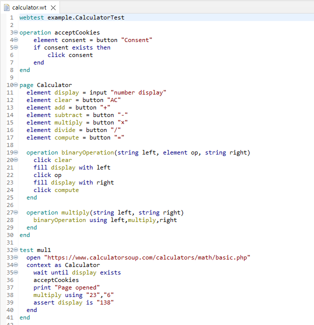

# Syntax highligthing

Syntax highligting improves the readability of the code. It can happen in two phases: lexical or semantic. In the lexical phase the elements created by the lexer are colored (e.g., keywords, comments). In the semantic phase the elements are colored based on the model created by the compiler (e.g. distinction between static and instance members). The results should be computed really fast, since the code should be recolored at each keystroke. Fortunately, Xtext caches everything it can.

In this task the keywords belonging to the declarations of the main structure of the code must be distinguished from the keywords of the statements. In addition, the page properties and operations referenced inside the **context as ... end** construct must be distinguished from the local variables and other operations. For simplicity, we will use semantic highlighting only.

The most important information about syntax highlighting can be found in the [Xtext](https://eclipse.dev/Xtext/documentation/310_eclipse_support.html#highlighting) documentation.

## Preparing the syntax highlighting

First, we have to define the categories of syntax elements which can have their own colors. These categories are also listed in the Eclipse preferences window (**Window > Preferences > Xtext Languages > WebTestDsl > Syntax Coloring**) so programmers can customize the elements themselves.

Inside the **webtest.dsl.ui** project create a **webtest.dsl.ui.highlighting** package, then create a **HighlightingConfiguration.java** file inside the package with the following content:

```Java
package webtest.dsl.ui.highlighting;

import org.eclipse.swt.graphics.RGB;
import org.eclipse.xtext.ide.editor.syntaxcoloring.HighlightingStyles;
import org.eclipse.xtext.ui.editor.syntaxcoloring.IHighlightingConfiguration;
import org.eclipse.xtext.ui.editor.syntaxcoloring.IHighlightingConfigurationAcceptor;
import org.eclipse.xtext.ui.editor.utils.TextStyle;

public class HighlightingConfiguration implements IHighlightingConfiguration {
    public static final String DEFAULT_ID = HighlightingStyles.DEFAULT_ID;
    public static final String INVALID_TOKEN_ID = HighlightingStyles.INVALID_TOKEN_ID;
    public static final String NUMBER_ID = HighlightingStyles.NUMBER_ID;
    public static final String STRING_ID = HighlightingStyles.STRING_ID;
    public static final String COMMENT_ID = HighlightingStyles.COMMENT_ID;
    public static final String PUNCTUATION_ID = HighlightingStyles.PUNCTUATION_ID;
    public static final String TASK_ID = HighlightingStyles.TASK_ID;
    public static final String KEYWORD_ID = HighlightingStyles.KEYWORD_ID;

    public static final String DECLARATION_ID = "DECLARATION_ID";
    public static final String PAGE_MEMBER_ID = "PAGE_MEMBER_ID";
    
    @Override
    public void configure(IHighlightingConfigurationAcceptor acceptor) {
        acceptor.acceptDefaultHighlighting(DEFAULT_ID, "Default", defaultTextStyle());
        acceptor.acceptDefaultHighlighting(INVALID_TOKEN_ID, "Invalid symbol", errorTextStyle());
        acceptor.acceptDefaultHighlighting(NUMBER_ID, "Number", numberTextStyle());
        acceptor.acceptDefaultHighlighting(STRING_ID, "String", stringTextStyle());
        acceptor.acceptDefaultHighlighting(COMMENT_ID, "Comment", commentTextStyle());
        acceptor.acceptDefaultHighlighting(PUNCTUATION_ID, "Punctuation character", punctuationTextStyle());
        acceptor.acceptDefaultHighlighting(TASK_ID, "Task Tag", taskTextStyle());
        acceptor.acceptDefaultHighlighting(KEYWORD_ID, "Keyword", keywordTextStyle());

        acceptor.acceptDefaultHighlighting(DECLARATION_ID, "Declaration", declarationTextStyle());
        acceptor.acceptDefaultHighlighting(PAGE_MEMBER_ID, "Page member", pageMemberTextStyle());
    }    
    
    public TextStyle defaultTextStyle() {
        var textStyle = new TextStyle();
        return textStyle;
    }

    public TextStyle errorTextStyle() {
        var textStyle = defaultTextStyle().copy();
        return textStyle;
    }
    
    public TextStyle numberTextStyle() {
        var textStyle = defaultTextStyle().copy();
        textStyle.setColor(new RGB(128, 0, 128));
        return textStyle;
    }

    public TextStyle stringTextStyle() {
        var textStyle = defaultTextStyle().copy();
        textStyle.setColor(new RGB(128, 0, 0));
        return textStyle;
    }

    public TextStyle commentTextStyle() {
        var textStyle = defaultTextStyle().copy();
        textStyle.setColor(new RGB(128, 128, 128));
        return textStyle;
    }

    public TextStyle punctuationTextStyle() {
        var textStyle = defaultTextStyle().copy();
        return textStyle;
    }
    
    public TextStyle taskTextStyle() {
        var textStyle = defaultTextStyle().copy();
        textStyle.setColor(new RGB(127, 159, 191));
        return textStyle;
    }
    
    public TextStyle keywordTextStyle() {
        var textStyle = defaultTextStyle().copy();
        textStyle.setColor(new RGB(0, 0, 128));
        return textStyle;
    }

    public TextStyle declarationTextStyle() {
        var textStyle = defaultTextStyle().copy();
        textStyle.setColor(new RGB(0, 128, 128));
        return textStyle;
    }
    
    public TextStyle pageMemberTextStyle() {
        var textStyle = defaultTextStyle().copy();
        textStyle.setColor(new RGB(128, 128, 0));
        return textStyle;
    }
}
```

In addition to the common Xtext styles, we define **DECLARATION_ID** for the declaration keywords, and **PAGE_MEMBER_ID** for page members.

Create a **WebTestDslHighlighter.java** file inside the **webtest.dsl.ui.highlighting** package with the following content:

```Java
package webtest.dsl.ui.highlighting;

import org.eclipse.xtext.Keyword;
import org.eclipse.xtext.ide.editor.syntaxcoloring.DefaultSemanticHighlightingCalculator;
import org.eclipse.xtext.ide.editor.syntaxcoloring.IHighlightedPositionAcceptor;
import org.eclipse.xtext.nodemodel.ILeafNode;
import org.eclipse.xtext.nodemodel.INode;
import org.eclipse.xtext.resource.XtextResource;
import org.eclipse.xtext.util.CancelIndicator;

import com.google.inject.Inject;

import webtest.dsl.services.WebTestDslGrammarAccess;
import webtest.model.Main;

public class WebTestDslHighlighter extends DefaultSemanticHighlightingCalculator {
    @Inject
    WebTestDslGrammarAccess ga;

    @Override
    public void provideHighlightingFor(XtextResource resource, IHighlightedPositionAcceptor acceptor, CancelIndicator cancelIndicator) {
        if (resource == null || resource.getParseResult() == null) return;
            
        var root = resource.getParseResult().getRootNode();
        for (var node : root.getAsTreeIterable()) {
            if (cancelIndicator.isCanceled()) return;
            var semanticElement = node.getSemanticElement();
            if (semanticElement instanceof Main) {
                keyword(acceptor, node, ga.getMainAccess().getWebtestKeyword_0(), HighlightingConfiguration.DECLARATION_ID);
            }
        }
    }
    
    protected void keyword(IHighlightedPositionAcceptor acceptor, INode node, Keyword keyword, String conf) {
        for (var leaf : node.getLeafNodes()) {
            var ge = leaf.getGrammarElement();
            if (keyword == ge) {
                highlight(acceptor, leaf, conf);
            }
        }
    }    
        
    protected void highlight(IHighlightedPositionAcceptor acceptor, INode node, String conf) {
        if(node == null) return;
        if(node instanceof ILeafNode) {
            acceptor.addPosition(node.getOffset(), node.getLength(), conf);
        } else {
            for(var leaf : node.getLeafNodes()) {
                if(!leaf.isHidden()) {
                    acceptor.addPosition(leaf.getOffset(), leaf.getLength(), conf);
                }
            }
        }
    }     
}
```

The code above colors the **webtest** keyword at the beginning of the WebTest file with the **DECLARATION_ID** style.

We must register the two classes we have created into the **WebTestDslUiModule** class in package **webtest.dsl.ui** so that Xtext can take them into account:

```Java
/*
 * generated by Xtext 2.35.0
 */
package webtest.dsl.ui;

import org.eclipse.ui.plugin.AbstractUIPlugin;
import org.eclipse.xtext.ide.editor.syntaxcoloring.ISemanticHighlightingCalculator;
import org.eclipse.xtext.ui.editor.syntaxcoloring.IHighlightingConfiguration;
import org.eclipse.xtext.ui.wizard.IProjectCreator;
import org.eclipse.xtext.ui.wizard.template.DefaultTemplateProjectCreator;

import webtest.dsl.ui.highlighting.HighlightingConfiguration;
import webtest.dsl.ui.highlighting.WebTestDslHighlighter;

/**
 * Use this class to register components to be used within the Eclipse IDE.
 */
public class WebTestDslUiModule extends AbstractWebTestDslUiModule {

	public WebTestDslUiModule(AbstractUIPlugin plugin) {
		super(plugin);
	}
	
	public Class<? extends IProjectCreator> bindIProjectCreator() {
		return DefaultTemplateProjectCreator.class;
	}
	
    public Class<? extends IHighlightingConfiguration> bindHighlightConf() {
        return HighlightingConfiguration.class;
    }

    public Class<? extends ISemanticHighlightingCalculator> bindSemanticCalculator() {
        return WebTestDslHighlighter.class;
    }
}
```

Start the **Runtime Eclipse** and check the result of adding the classes above:


## Implementing syntax highlighting

Modify the **WebTestDslHighlighter** class so that it colors the following elements using the **DECLARATION_ID** style:

* For a **Page**: the opening **page** and the closing **end** keyword
* For an **Operation**: the opening **operation** and the closing **end** keyword
* For a **TestCase**: the opening **test** and the closing **end** keyword
* If you have to implement the **TestParams** extension, then for each **TestCaseInstance**: the **with** with keyword
* If you have to implement the **Manual** extension, then the opening **manual** and the closing **end** keyword

Modify the **WebTestDslHighlighter** class so that it colors the following elements using the **PAGE_MEMBER_ID** style (these tasks are hard):

* Inside a **Page**: member variable and operation names
* Inside a **VariableExpression**: the name of the variable if it is a **Page** member variable
* Inside a **CallStatement**: the name of the operation if it is a **Page** member operation

***HINT:** The following elements may help you to implement this task:*

* *An **INode** syntax node's **getGrammarElement()** method returns the grammar rule from which this syntax node was created.*
* *An **INode** syntax node's **getSemanticElement()** method returns the Xcore object that was created from this syntax node.*
* *The type of the grammar element can be checked using the **instanceof** operator. From a **RuleCall** grammar element the grammar rule can be retrieved, and it can be compared to the grammar rules listed in **WebTestDslGrammarAccess**.*
* *The type of the semantic element can be checked using the **instanceof** operator and can be compared to an Xcore type.*
* *Methods defined in the **NodeModelUtils** class can be useful.*
* *From an Xcore object, the **eContainer()** method can be used to get the container object. This can help to determine whether a variable or operation is a **Page**-member.*

## Check the solution

The result should look like this in the **Runtime Eclipse**:



## To be uploaded

During the solution of the task, take screenshots taken from the following parts, and upload them into the folder **homeworks/hw2** of your own git repo:

* The syntax highlighted code of a WebTest file of at least 20 lines long opened in **Runtime Eclipse** which contains at least one of every relevant element from the language.
