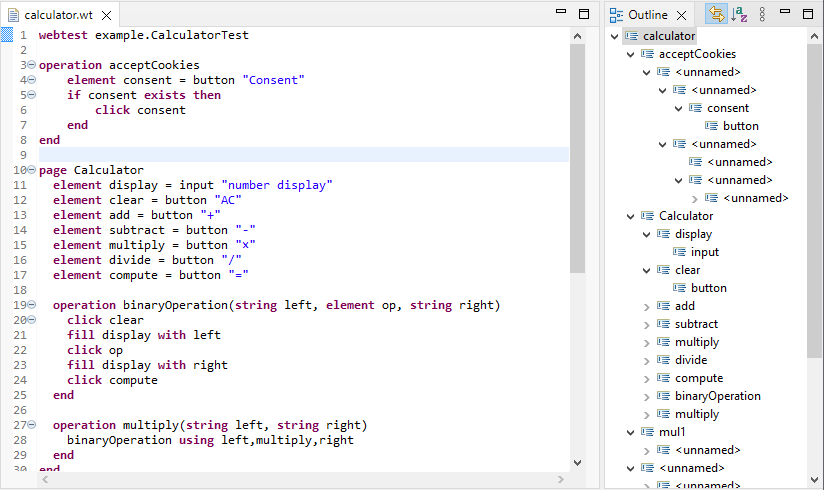
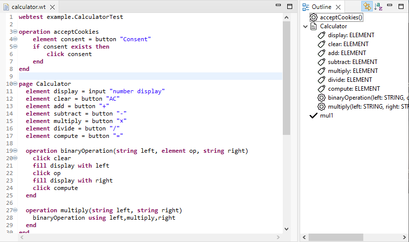

# Outline view

The outline view shows and overview about the structure of the code. The default outline view created by Xtext looks like in **Runtime Eclipse** as follows:

By default, every element in the model is visible, but many of them are not really useful.

In this task, the goal is to provide a more meaningful outline.

The structure of the outline view can be customized using the [OutlineTreeProvider](https://eclipse.dev/Xtext/documentation/310_eclipse_support.html#outline), and the details of the visible elements can be customized using the [LabelProvider](https://eclipse.dev/Xtext/documentation/310_eclipse_support.html#label-provider).

## Outline structure

Inside the **webtest.dsl.ui** project in the **webtest.dsl.ui.outline** package the **WebTestDslOutlineTreeProvider** class can be used to customize the structure of the outline.

Modify the **WebTestDslOutlineTreeProvider** class so that only the following elements become visible in the structure:

* at the topmost level the **Page**, **TestCase** and **Operation** objects
* if you have to implement the **Manual** extension, then the **Manual** objects must also appear at the topmost level
* member properties (**variables**) and operations (**operations**) of the **Page** objects

Other model elements must not be visible.

***HINT:** Create the appropriate **_createChildren** and **_isLeaf** methods as described in the [Xtext](https://eclipse.dev/Xtext/documentation/310_eclipse_support.html#outline) documentation.*

## Labels

Inside the **webtest.dsl.ui** project in the **webtest.dsl.ui.labeling** package the **WebTestDslLabelProvider** class can be used to customize the labels and icons of the model elements displayed in the outline view. The icons can be found in the **webtest.dsl.ui** project under the **icons** folder.

Modify the **WebTestDslLabelProvider** class so that the following information is displayed for each outline element:

* **Page**:
  * text: Name of the page. e.g., `Google`
  * icon: `page.png`
* **TestCase**:
  * text: Name of the test case. If you have to implement the **TestParams** extension, list the parameters of the test after the name of the test. The parameters should be separated by commas and enclosed in parenthesis. For each parameter the name of the parameter should be followed by a colon and a space character, and then the type of the parameter should be displayed. If a test case does not have parameters, then the parenthesis should not be displayed, either. e.g., `TestLogin(username: STRING, password: STRING)` or `TestWithoutParameters`
  * icon: `test.png`
* **Manual**:
  * text: Name of the manual. e.g., `Search`
  * icon: `manual.png`
* **Variable**:
  * text: Name of the variable followed by a colon, a space and the type of the variable. e.g., `name: STRING`
  * icon: `attribute.png`
* **Operation**:
  * text: Name of the operation followed by the comma separated list of parameters enclosed in parenthesis. The parenthesis is required even if there are no parameters. For each parameter the name of the parameter should be followed by a colon and a space character, and then the type of the parameter should be displayed. e.g., `login(username: STRING, password: STRING)` or `logout()`
  * icon: `operation.png`

***HINT:** Create the appropriate **text** and **image** methods as described by the [Xtext](https://eclipse.dev/Xtext/documentation/310_eclipse_support.html#label-provider) documentation.*

## Check the solution

If you have implemented everything correctly, the final result in the **Runtime Eclipse** should look like:

You can check your solution using the **webtest.dsl.ui.tests** project, by running it as a JUnit test (**Run as > JUnit Plug-in Test**). The **OutlineTests** class checks the correctness of the outline view.

## To be uploaded

During the solution of the task, take screen shots taken from the following parts, and upload them into the folder **homeworks/hw2** of your own git repo:

* The test summary window in **Eclipse** for the **webtest.dsl.ui.tests** project, which shows that all the tests in **OutlineTests** are executed successfully.
* The outline view and the code of a WebTest file of at least 20 lines long opened in **Runtime Eclipse** which contains every relevant element in the outline.
