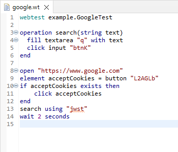
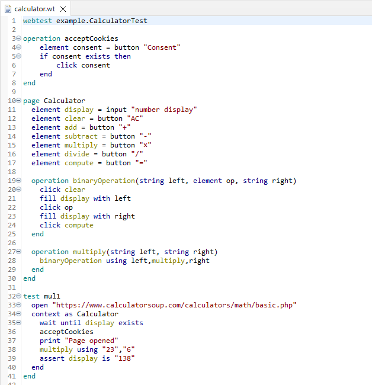

# Kódszínezés (syntax coloring, highlighting)

A kódszínezés a kód olvashatóságát javítja. A kódszínezés két fázisban történhet: lexikai és szemantikai. A lexikai fázisban a lexer által előállított elemeket színezzük, pl. kulcsszavak, kommentek, stb. A szemantikai fázisban a fordító által értelmezett modell alapján végzünk színezést, pl. statikus és tagváltozók megkülönböztetése, tagváltozók és lokális változók megkülönböztetése, stb. Mindkét fázisban nagyon gyorsan ki kell számolni az eredményt, hiszen billentyűleütésre újra kell számolni a színeket, bár az Xtext amit csak lehet, cache-el.

Ebben a részfeladatban a WebTest fájl szerkezetét alkotó deklarációk kulcsszavait kell megkülönböztetni az utasítások kulcsszavaitól, valamint a **context as ... end** kontextusban a hivatkozott weboldalmodellből feloldott változókat és operációkat kell megkülönböztetni a lokális változóktól. Az egyszerűség kedvéért csak szemantikus kódszínezést fogunk használni.

A kódszínezéssel kapcsolatos legfontosabb információkat [itt találhatjuk](https://eclipse.dev/Xtext/documentation/310_eclipse_support.html#highlighting).

## Kódszínezés előkészítése

Először meg kell határozni azokat a kategóriákat, amelyek önálló színeket kaphatnak. Ezek a kategóriák az Eclipse beállításoknál (**Window > Preferences > Xtext Languages > WebTestDsl > Syntax Coloring**) szerkeszthetővé is válnak, így a felhasználók saját maguk konfigurálhatják az általuk preferált színeket.

A **webtest.dsl.ui** projektben hozzatok létre egy **webtest.dsl.ui.highlighting** csomagot, benne pedig egy **HighlightingConfiguration.java** fájlt a következő tartalommal:

```Java
package webtest.dsl.ui.highlighting;

import org.eclipse.swt.graphics.RGB;
import org.eclipse.xtext.ide.editor.syntaxcoloring.HighlightingStyles;
import org.eclipse.xtext.ui.editor.syntaxcoloring.IHighlightingConfiguration;
import org.eclipse.xtext.ui.editor.syntaxcoloring.IHighlightingConfigurationAcceptor;
import org.eclipse.xtext.ui.editor.utils.TextStyle;

public class HighlightingConfiguration implements IHighlightingConfiguration {
    public static final String DEFAULT_ID = HighlightingStyles.DEFAULT_ID;
    public static final String INVALID_TOKEN_ID = HighlightingStyles.INVALID_TOKEN_ID;
    public static final String NUMBER_ID = HighlightingStyles.NUMBER_ID;
    public static final String STRING_ID = HighlightingStyles.STRING_ID;
    public static final String COMMENT_ID = HighlightingStyles.COMMENT_ID;
    public static final String PUNCTUATION_ID = HighlightingStyles.PUNCTUATION_ID;
    public static final String TASK_ID = HighlightingStyles.TASK_ID;
    public static final String KEYWORD_ID = HighlightingStyles.KEYWORD_ID;

    public static final String DECLARATION_ID = "DECLARATION_ID";
    public static final String PAGE_MEMBER_ID = "PAGE_MEMBER_ID";
    
    @Override
    public void configure(IHighlightingConfigurationAcceptor acceptor) {
        acceptor.acceptDefaultHighlighting(DEFAULT_ID, "Default", defaultTextStyle());
        acceptor.acceptDefaultHighlighting(INVALID_TOKEN_ID, "Invalid symbol", errorTextStyle());
        acceptor.acceptDefaultHighlighting(NUMBER_ID, "Number", numberTextStyle());
        acceptor.acceptDefaultHighlighting(STRING_ID, "String", stringTextStyle());
        acceptor.acceptDefaultHighlighting(COMMENT_ID, "Comment", commentTextStyle());
        acceptor.acceptDefaultHighlighting(PUNCTUATION_ID, "Punctuation character", punctuationTextStyle());
        acceptor.acceptDefaultHighlighting(TASK_ID, "Task Tag", taskTextStyle());
        acceptor.acceptDefaultHighlighting(KEYWORD_ID, "Keyword", keywordTextStyle());

        acceptor.acceptDefaultHighlighting(DECLARATION_ID, "Declaration", declarationTextStyle());
        acceptor.acceptDefaultHighlighting(PAGE_MEMBER_ID, "Page member", pageMemberTextStyle());
    }    
    
    public TextStyle defaultTextStyle() {
        var textStyle = new TextStyle();
        return textStyle;
    }

    public TextStyle errorTextStyle() {
        var textStyle = defaultTextStyle().copy();
        return textStyle;
    }
    
    public TextStyle numberTextStyle() {
        var textStyle = defaultTextStyle().copy();
        textStyle.setColor(new RGB(128, 0, 128));
        return textStyle;
    }

    public TextStyle stringTextStyle() {
        var textStyle = defaultTextStyle().copy();
        textStyle.setColor(new RGB(128, 0, 0));
        return textStyle;
    }

    public TextStyle commentTextStyle() {
        var textStyle = defaultTextStyle().copy();
        textStyle.setColor(new RGB(128, 128, 128));
        return textStyle;
    }

    public TextStyle punctuationTextStyle() {
        var textStyle = defaultTextStyle().copy();
        return textStyle;
    }
    
    public TextStyle taskTextStyle() {
        var textStyle = defaultTextStyle().copy();
        textStyle.setColor(new RGB(127, 159, 191));
        return textStyle;
    }
    
    public TextStyle keywordTextStyle() {
        var textStyle = defaultTextStyle().copy();
        textStyle.setColor(new RGB(0, 0, 128));
        return textStyle;
    }

    public TextStyle declarationTextStyle() {
        var textStyle = defaultTextStyle().copy();
        textStyle.setColor(new RGB(0, 128, 128));
        return textStyle;
    }
    
    public TextStyle pageMemberTextStyle() {
        var textStyle = defaultTextStyle().copy();
        textStyle.setColor(new RGB(128, 128, 0));
        return textStyle;
    }
}
```

Az Xtext beépített konfigurációin felül a **DECLARATION_ID** a WebTest kód vázát alkotó deklarációk színezését, a **PAGE_MEMBER_ID** pedig a kontextuson belül feloldott tagok színezését reprezentálja. A többi stílus az Xtext beépített stílusa.

Hozzatok létre egy **WebTestDslHighlighter.java** fájlt a **webtest.dsl.ui.highlighting** csomagban a következő tartalommal:

```Java
package webtest.dsl.ui.highlighting;

import org.eclipse.xtext.Keyword;
import org.eclipse.xtext.ide.editor.syntaxcoloring.DefaultSemanticHighlightingCalculator;
import org.eclipse.xtext.ide.editor.syntaxcoloring.IHighlightedPositionAcceptor;
import org.eclipse.xtext.nodemodel.ILeafNode;
import org.eclipse.xtext.nodemodel.INode;
import org.eclipse.xtext.resource.XtextResource;
import org.eclipse.xtext.util.CancelIndicator;

import com.google.inject.Inject;

import webtest.dsl.services.WebTestDslGrammarAccess;
import webtest.model.Main;

public class WebTestDslHighlighter extends DefaultSemanticHighlightingCalculator {
    @Inject
    WebTestDslGrammarAccess ga;

    @Override
    public void provideHighlightingFor(XtextResource resource, IHighlightedPositionAcceptor acceptor, CancelIndicator cancelIndicator) {
        if (resource == null || resource.getParseResult() == null) return;
            
        var root = resource.getParseResult().getRootNode();
        for (var node : root.getAsTreeIterable()) {
            if (cancelIndicator.isCanceled()) return;
            var semanticElement = node.getSemanticElement();
            if (semanticElement instanceof Main) {
                keyword(acceptor, node, ga.getMainAccess().getWebtestKeyword_0(), HighlightingConfiguration.DECLARATION_ID);
            }
        }
    }
    
    protected void keyword(IHighlightedPositionAcceptor acceptor, INode node, Keyword keyword, String conf) {
        for (var leaf : node.getLeafNodes()) {
            var ge = leaf.getGrammarElement();
            if (keyword == ge) {
                highlight(acceptor, leaf, conf);
            }
        }
    }    
        
    protected void highlight(IHighlightedPositionAcceptor acceptor, INode node, String conf) {
        if(node == null) return;
        if(node instanceof ILeafNode) {
            acceptor.addPosition(node.getOffset(), node.getLength(), conf);
        } else {
            for(var leaf : node.getLeafNodes()) {
                if(!leaf.isHidden()) {
                    acceptor.addPosition(leaf.getOffset(), leaf.getLength(), conf);
                }
            }
        }
    }     
}
```

A fenti kód kiszínezi a **webtest** kulcsszót a fájl elején.

Ahhoz, hogy a fenti két osztály meghívásra kerüljön, be kell őket regisztrálni a **webtest.dsl.ui** csomagban lévő **WebTestDslUiModule** osztályba:

```Java
package webtest.dsl.ui;

import org.eclipse.ui.plugin.AbstractUIPlugin;
import org.eclipse.xtext.ide.editor.syntaxcoloring.ISemanticHighlightingCalculator;
import org.eclipse.xtext.ui.editor.syntaxcoloring.IHighlightingConfiguration;

import webtest.dsl.ui.highlighting.HighlightingConfiguration;
import webtest.dsl.ui.highlighting.WebTestDslHighlighter;

/**
 * Use this class to register components to be used within the Eclipse IDE.
 */
public class WebTestDslUiModule extends AbstractWebTestDslUiModule {

    public WebTestDslUiModule(AbstractUIPlugin plugin) {
        super(plugin);
    }
    
    public Class<? extends IHighlightingConfiguration> bindHighlightConf() {
        return HighlightingConfiguration.class;
    }

    public Class<? extends ISemanticHighlightingCalculator> bindSemanticCalculator() {
        return WebTestDslHighlighter.class;
    }
}
```

Indítsátok el a **Runtime Eclipse**-et, és vizsgáljátok meg a fenti kódrészletek hatását:



## Kódszínezés megvalósítása

Módosítsátok a **WebTestDslHighlighter** osztályt, hogy az alábbi elemeket is kiszínezze **DECLARATION_ID** stílusúra:

* Egy **Page** esetén a nyitó **page** és a záró **end** kulcsszót
* Egy **Operation** esetén a nyitó **operation**, a **using** és a záró **end** kulcsszót
* Egy **TestCase** esetén a nyitó **test** és a záró **end** kulcsszót
* Ha a **TestParams** bővítményt meg kell valósítanotok, akkor a **TestCase**-hez tartozó **using** és a **TestCaseInstance**-hoz tartózó **with** kulcsszót
* Ha a **Manual** bővítményt meg kell valósítanotok, akkor a nyitó **manual** és a záró **end** kulcsszót

Módosítsátok a **WebTestDslHighlighter** osztályt, hogy az alábbi elemeket is kiszínezze **PAGE_MEMBER_ID** stílusúra (ezek nehéz feladatok):

* Egy **Page**-en belül az oldal változóinak és operációinak nevét
* Egy **VariableExpression**-ön belül a változó nevét, ha az egy **Page** saját változója
* Egy **CallStatement**-en belül az operáció nevét, ha az egy **Page** saját operációja

***TIPP:** A következő elemek segíthetnek a megvalósításban:*

* *Egy **INode** szintaxiscsúcs **grammarElement** attribútuma arra a nyelvtani szabályra mutat, amelyből az adottszintaxiscsúcs keletkezett.*
* *Egy **INode** szintaxiscsúcs **semanticElement** attribútuma arra az Xcore modellelemre mutat, amely az adott szintaxiscsúcs alapján jött létre.*
* *A **grammarElement** típusa vizsgálható az **instanceof** operátorral. A **RuleCall** típusú elemből az alkalmazott nyelvtani szabály kinyerhető és összehasonlítható a **WebTestDslGrammarAccess**-ben elérhető szabályokkal.*
* *A **semanticElement** típusa vizsgálható az **instanceof** operátorral és egy megfelelő Xcore-ban definiált típussal.*
* *Hasznosak lehetnek még a **NodeModelUtils** osztályban elérhető függvények.*
* *Egy modellbeli objektumtól az **eContainer** attribútummal elkérhető az őt tartalmazó objektum, így könnyű megvizsgálni, hogy egy változó vagy operáció **Page**-ben van-e definiálva.*

## Ellenőrzés

A végeredménynek a következőképpen kell kinéznie:



## Feltöltendő

Ha ezt a részfeladatot sikerült megoldani, készítsetek screenshot-okat és töltsétek fel a képeket a saját repótokon belül a **homeworks/hw2** mappába az alábbiakról:

* A **Runtime Eclipse**-ben megnyitott legalább 20 soros **.wt** kiterjesztésű fájl szépen kiszínezve, amely minden releváns WebTest nyelvi elemből legalább egyet tartalmaz.
