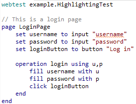
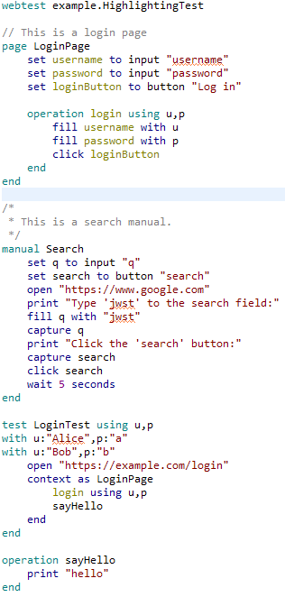

# Kódszínezés (syntax coloring, highlighting)

A kódszínezés a kód olvashatóságát javítja. A kódszínezés két fázisban történhet: lexikai és szemantikai. A lexikai fázisban a lexer által előállított elemeket színezzük, pl. kulcsszavak, kommentek, stb. A szemantikai fázisban a fordító által értelmezett modell alapján végzünk színezést,pl. statikus és tagváltozók megkülönböztetése, tagváltozók és lokális változók megkülönböztetése, stb. Mindkét fázisban nagyon gyorsan ki kell számolni az eredményt, hiszen billentyűleütésre újra kell számolni a színeket, bár az Xtext amit csak lehet, cache-el.

Ebben a részfeladatban a WebTest fájl szerkezetét alkotó deklarációk kulcsszavait kell megkülönböztetni az utasítások kulcsszavaitól, valamint a **context as ... end** kontextusban a hivatkozott weboldalmodellből feloldott változókat és operációkat kell megkülönböztetni a lokális változóktól. Az egyszerűség kedvéért csak szemantikus kódszínezést fogunk használni.

A kódszínezéssel kapcsolatos legfontosabb információkat [itt találhatjuk](https://eclipse.dev/Xtext/documentation/310_eclipse_support.html#highlighting).

## Kódszínezés előkészítése

Először meg kell határozni azokat a kategóriákat, amelyek önálló színeket kaphatnak. Ezek a kategóriák az Eclipse beállításoknál (**Window > Preferences > Xtext Languages > WebTestDsl > Syntax Coloring**) szerkeszthetővé is válnak, így a felhasználók saját maguk konfigurálhatják az általuk preferált színeket.

A **webtest.dsl.ui** projektben hozzatok létre egy **webtest.dsl.ui.highlighting** csomagot, benne pedig egy **HighlightingConfiguration.xtend** fájlt a következő tartalommal:

```
package webtest.dsl.ui.highlighting

import org.eclipse.swt.SWT
import org.eclipse.swt.graphics.RGB
import org.eclipse.xtext.ide.editor.syntaxcoloring.HighlightingStyles
import org.eclipse.xtext.ui.editor.syntaxcoloring.IHighlightingConfiguration
import org.eclipse.xtext.ui.editor.syntaxcoloring.IHighlightingConfigurationAcceptor
import org.eclipse.xtext.ui.editor.utils.TextStyle

class HighlightingConfiguration implements IHighlightingConfiguration {
    public static final String DEFAULT_ID = HighlightingStyles.DEFAULT_ID
    public static final String INVALID_TOKEN_ID = HighlightingStyles.INVALID_TOKEN_ID
    public static final String NUMBER_ID = HighlightingStyles.NUMBER_ID
    public static final String STRING_ID = HighlightingStyles.STRING_ID
    public static final String COMMENT_ID = HighlightingStyles.COMMENT_ID
    public static final String PUNCTUATION_ID = HighlightingStyles.PUNCTUATION_ID
    public static final String TASK_ID = HighlightingStyles.TASK_ID
    public static final String KEYWORD_ID = HighlightingStyles.KEYWORD_ID

    public static final String DECLARATION_ID = "DECLARATION_ID"
    public static final String PAGE_MEMBER_ID = "PAGE_MEMBER_ID"
    
    override configure(IHighlightingConfigurationAcceptor acceptor) {
        acceptor.acceptDefaultHighlighting(DEFAULT_ID, "Default", defaultTextStyle());
        acceptor.acceptDefaultHighlighting(INVALID_TOKEN_ID, "Invalid symbol", errorTextStyle());
        acceptor.acceptDefaultHighlighting(NUMBER_ID, "Number", numberTextStyle());
        acceptor.acceptDefaultHighlighting(STRING_ID, "String", stringTextStyle());
        acceptor.acceptDefaultHighlighting(COMMENT_ID, "Comment", commentTextStyle());
        acceptor.acceptDefaultHighlighting(PUNCTUATION_ID, "Punctuation character", punctuationTextStyle());
        acceptor.acceptDefaultHighlighting(TASK_ID, "Task Tag", taskTextStyle());
        acceptor.acceptDefaultHighlighting(KEYWORD_ID, "Keyword", keywordTextStyle());

        acceptor.acceptDefaultHighlighting(DECLARATION_ID, "Declaration", declarationTextStyle());
        acceptor.acceptDefaultHighlighting(PAGE_MEMBER_ID, "Page member", pageMemberTextStyle());
    }    
    
    def TextStyle defaultTextStyle() {
        val textStyle = new TextStyle();
        return textStyle;
    }

    def TextStyle errorTextStyle() {
        val textStyle = defaultTextStyle().copy();
        return textStyle;
    }
    
    def TextStyle numberTextStyle() {
        val textStyle = defaultTextStyle().copy();
        textStyle.setColor(new RGB(128, 0, 128));
        return textStyle;
    }

    def TextStyle stringTextStyle() {
        val textStyle = defaultTextStyle().copy();
        textStyle.setColor(new RGB(128, 0, 0));
        return textStyle;
    }

    def TextStyle commentTextStyle() {
        val textStyle = defaultTextStyle().copy();
        textStyle.setColor(new RGB(128, 128, 128));
        return textStyle;
    }

    def TextStyle punctuationTextStyle() {
        val textStyle = defaultTextStyle().copy();
        return textStyle;
    }
    
    def TextStyle taskTextStyle() {
        val textStyle = defaultTextStyle().copy();
        textStyle.setColor(new RGB(127, 159, 191));
        return textStyle;
    }
    
    def TextStyle keywordTextStyle() {
        val textStyle = defaultTextStyle().copy();
        textStyle.setColor(new RGB(0, 0, 128));
        return textStyle;
    }

    def TextStyle declarationTextStyle() {
        val textStyle = defaultTextStyle().copy();
        textStyle.setColor(new RGB(0, 128, 128));
        return textStyle;
    }
    
    def TextStyle pageMemberTextStyle() {
        val textStyle = defaultTextStyle().copy();
        textStyle.setColor(new RGB(128, 128, 0));
        return textStyle;
    }
}
```

Az Xtext beépített konfigurációin felül a **DECLARATION_ID** a WebTest kód vázát alkotó deklarációk színezését, a **PAGE_MEMBER_ID** pedig a kontextuson belül feloldott tagok színezését reprezentálja. A többi stílus az Xtext beépített stílusa.

Hozzatok létre egy **WebTestDslHighlighter.xtend** fájlt a **webtest.dsl.ui.highlighting** csomagban a következő tartalommal:

```
package webtest.dsl.ui.highlighting

import com.google.inject.Inject
import org.eclipse.xtext.Keyword
import org.eclipse.xtext.ide.editor.syntaxcoloring.DefaultSemanticHighlightingCalculator
import org.eclipse.xtext.ide.editor.syntaxcoloring.IHighlightedPositionAcceptor
import org.eclipse.xtext.nodemodel.ILeafNode
import org.eclipse.xtext.nodemodel.INode
import org.eclipse.xtext.resource.XtextResource
import org.eclipse.xtext.util.CancelIndicator
import webtest.dsl.services.WebTestDslGrammarAccess
import webtest.model.Main

class WebTestDslHighlighter extends DefaultSemanticHighlightingCalculator {
    @Inject
    WebTestDslGrammarAccess ga;

    override provideHighlightingFor(XtextResource resource, IHighlightedPositionAcceptor acceptor, CancelIndicator cancelIndicator) {
        if (resource?.parseResult === null) return;
            
        val root = resource.parseResult.rootNode
        for (node : root.getAsTreeIterable()) {
            if (cancelIndicator.canceled) return;
            if (node.semanticElement instanceof Main) {
                keyword(acceptor, node, ga.mainAccess.webtestKeyword_0, HighlightingConfiguration.DECLARATION_ID);
            }
        }
    }
    
    protected def void keyword(IHighlightedPositionAcceptor acceptor, INode node, Keyword keyword, String conf) {
        for (leaf : node.leafNodes) {
            var ge = leaf.grammarElement
            if (keyword == ge) {
                highlight(acceptor, leaf, conf);
            }
        }
    }    
    
    protected def void highlight(IHighlightedPositionAcceptor acceptor, INode node, String conf) {
        if(node === null) return;
        if(node instanceof ILeafNode) {
            acceptor.addPosition(node.offset, node.length, conf);
        } else {
            for(leaf : node.leafNodes) {
                if(!leaf.hidden) {
                    acceptor.addPosition(leaf.offset, leaf.length, conf);
                }
            }
        }
    }     
}
```

A fenti kód kiszínezi a **webtest** kulcsszót a fájl elején.

Ahhoz, hogy a fenti két osztály meghívásra kerüljön, be kell őket regisztrálni a **webtest.dsl.ui** csomagban lévő **WebTestDslUiModule** osztályba:

```
package webtest.dsl.ui

import org.eclipse.xtend.lib.annotations.FinalFieldsConstructor
import org.eclipse.xtext.ide.editor.syntaxcoloring.ISemanticHighlightingCalculator
import org.eclipse.xtext.ui.editor.syntaxcoloring.IHighlightingConfiguration
import webtest.dsl.ui.highlighting.HighlightingConfiguration
import webtest.dsl.ui.highlighting.WebTestDslHighlighter

/**
 * Use this class to register components to be used within the Eclipse IDE.
 */
@FinalFieldsConstructor
class WebTestDslUiModule extends AbstractWebTestDslUiModule {
    def Class<? extends IHighlightingConfiguration> bindHighlightConf() {
        HighlightingConfiguration
    }

    def Class<? extends ISemanticHighlightingCalculator> bindSemanticCalculator() {
        WebTestDslHighlighter
    }
}
```

Indítsátok el a **Runtime Eclipse**-et, és vizsgáljátok meg a fenti kódrészletek hatását:



## Kódszínezés megvalósítása

Módosítsátok a **WebTestDslHighlighter** osztályt, hogy az alábbi elemeket is kiszínezze **DECLARATION_ID** stílusúra:

* Egy **Page** esetén a nyitó **page** és a záró **end** kulcsszót
* Egy **Operation** esetén a nyitó **operation**, a **using** és a záró **end** kulcsszót
* Egy **TestCase** esetén a nyitó **test** és a záró **end** kulcsszót
* Ha a **TestParams** bővítményt meg kell valósítanotok, akkor a **TestCase**-hez tartozó **using** és a **TestCaseInstance**-hoz tartózó **with** kulcsszót
* Ha a **Manual** bővítményt meg kell valósítanotok, akkor a nyitó **manual** és a záró **end** kulcsszót

Módosítsátok a **WebTestDslHighlighter** osztályt, hogy az alábbi elemeket is kiszínezze **PAGE_MEMBER_ID** stílusúra:

* Egy **Page**-en belül az oldal változóinak és operációinak nevét
* Egy **VariableExpression**-ön belül a változó nevét, ha az egy **Page** saját változója
* Egy **CallStatement**-en belül az operáció nevét, ha az egy **Page** saját operációja

***TIPP:** A következő elemek segíthetnek a megvalósításban:*

* *Egy **INode** szintaxiscsúcs **grammarElement** attribútuma arra a nyelvtani szabályra mutat, amelyből az adottszintaxiscsúcs keletkezett.*
* *Egy **INode** szintaxiscsúcs **semanticElement** attribútuma arra az Xcore modellelemre mutat, amely az adott szintaxiscsúcs alapján jött létre.*
* *A **grammarElement** típusa vizsgálható az **instanceof** operátorral. A **RuleCall** típusú elemből az alkalmazott nyelvtani szabály kinyerhető és összehasonlítható a **WebTestDslGrammarAccess**-ben elérhető szabályokkal.*
* *A **semanticElement** típusa vizsgálható az **instanceof** operátorral és egy megfelelő Xcore-ban definiált típussal.*
* *Hasznosak lehetnek még a **NodeModelUtils** osztályban elérhető függvények.*
* *Egy modellbeli objektumtól az **eContainer** attribútummal elkérhető az őt tartalmazó objektum, így könnyű megvizsgálni, hogy egy változó vagy operáció **Page**-ben van-e definiálva.*

## Ellenőrzés

A végeredménynek a következőképpen kell kinéznie:



## Feltöltendő

Ha ezt a részfeladatot sikerült megoldani, készítsetek screenshot-okat és töltsétek fel a képeket a saját repótokon belül a **homeworks/hw2** mappába az alábbiakról:

* A **Runtime Eclipse**-ben megnyitott legalább 20 soros **.wt** kiterjesztésű fájl szépen kiszínezve, amely minden releváns WebTest nyelvi elemből legalább egyet tartalmaz.
