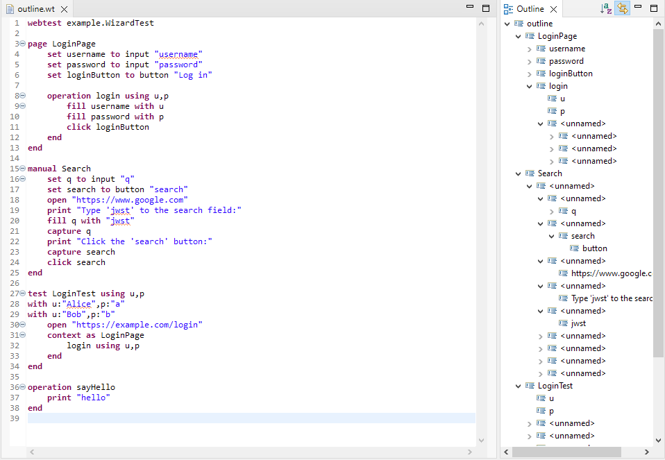
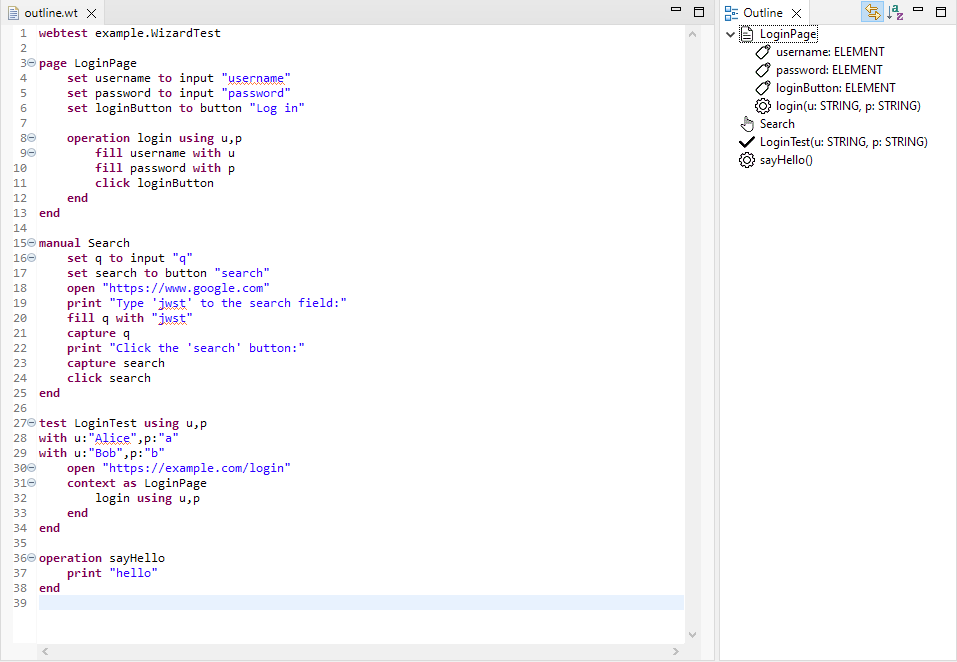

# Kódvázlat (outline view, label provider)

Az outline (vázlat) nézet segítségével a kód szerkezetéről kapunk áttekintő képet. Az Xtext által generált alapértelmezett outline nézet így néz ki:

Az alapértelmezett nézetben minden modellbeli elem látható, de sok elemnek nincs érdemben használható nézete.

Ebben a részfeladatban a cél az, hogy csak azokra a modellelemekre szorítkozzunk az outline nézetben, amelyeknek érdemi információtartalma van, és a nézet a neveken túl további hasznos részletekkel is szolgáljon.

Az outline nézet struktúráját az [OutlineTreeProvider](https://eclipse.dev/Xtext/documentation/310_eclipse_support.html#outline) segítségével, a megjelenő elemek részleteit a [LabelProvider](https://eclipse.dev/Xtext/documentation/310_eclipse_support.html#label-provider) segítségével lehet testre szabni.

## Outline struktúrája

A **webtest.dsl.ui** projekten belül a **webtest.dsl.ui.outline** csomagban található a **WebTestDslOutlineTreeProvider** osztály. Ebben kell megvalósítanotok a nézet kívánt struktúráját.

Módosítsátok úgy a **WebTestDslOutlineTreeProvider** osztályt, hogy csak az alábbi modellelemek jelenjenek meg a struktúrában:

* legfelső szinten csak a **Page**, **TestCase** és **Operation** objektumok
* ha a **Manual** bővítményt meg kell valósítanunk, akkor a **Manual** objektumok is jelenjenek meg a legfelső szinten
* a **Page** alatt az oldal változói (**variables**) és operációi (**operations**)

A többi modellelem ne látszódjon az outline nézetben.

***TIPP:** Hozzátok létre a megfelelő **_createChildren** és **_isLeaf** függvényeket, ahogy az [Xtext](https://eclipse.dev/Xtext/documentation/310_eclipse_support.html#outline) dokumentáció előírja.*

## Címkék

A **webtest.dsl.ui** projekten belül a **webtest.dsl.ui.labeling** csomagban található a **WebTestDslLabelProvider** osztály. Ebben kell megvalósítanotok a címkék megfelelő feliratát és ikonját. Az ikonokat a **webtest.dsl.ui** projekt **icons** könyvtára tartalmazza.

Módosítsátok úgy a **WebTestDslLabelProvider** osztályt, hogy az egyes elemeknél az alábbiak legyenek láthatók:

* **Page**:
  * szöveg: Az oldal neve. Pl. `Google`
  * ikon: `page.png`
* **TestCase**:
  * szöveg: A teszteset neve. Ha a **TestParams** bővítményt meg kell valósítanotok, a teszteset neve után zárójelben vesszőkkel elválasztva fel kell sorolni a teszteset paramétereit. Ha a tesztesetnek nincsenek paraméterei, akkor a zárójelek sem kellenek. A paraméterek úgy jelennek meg, mint a változók: a paraméter nevét követően egy kettőspont és egy szóköz, majd a paraméter típusa. Pl. `TestLogin(username: STRING, password: STRING)` vagy `TestWithoutParameters`
  * ikon: `test.png`
* **Manual**:
  * szöveg: A kézikönyv neve. Pl. `Search`
  * ikon: `manual.png`
* **Variable**:
  * szöveg: A változó neve, majd egy kettőspont és egy szóköz után a változó típusa. Pl. `name: STRING`
  * ikon: `attribute.png`
* **Operation**:
  * szöveg: Az operáció neve, majd zárójelben az operáció paraméterei vesszőkkel elválasztva. A zárójelek akkor is kellenek, ha nincsenek paraméterei az operációnak. A paraméterek úgy jelennek meg, mint a változók: a paraméter nevét követően egy kettőspont és egy szóköz, majd a paraméter típusa. Pl. `login(username: STRING, password: STRING)` vagy `logout()`
  * ikon: `operation.png`

***TIPP:** Hozzátok létre a megfelelő **text** és **image** függvényeket, ahogy az [Xtext](https://eclipse.dev/Xtext/documentation/310_eclipse_support.html#label-provider) dokumentáció előírja.*

## Ellenőrzés

Ha mindent megfelelően implementáltatok, a végeredmény a következő lesz:

Az outline és a címkék helyes működését a **webtest.dsl.ui.tests** projekt JUnit tesztként való futtatásával (**Run as > JUnit Plug-in Test**) is ellenőrizhetitek a **OutlineTests** tesztelő osztály segítségével.

## Feltöltendő

Ha ezt a részfeladatot sikerült megoldani, készítsetek screenshot-okat és töltsétek fel a képeket a saját repótokon belül a **homeworks/hw2** mappába az alábbiakról:

* Az **OutlineTests** összes tesztjének sikeres lefutása
* A **Runtime Eclipse**-ben megnyitott legalább 20 soros **.wt** kiterjesztésű fájl és annak outline nézete teljesen kibontva, amely minden releváns elemet tartalmaz az outline nézetből.
