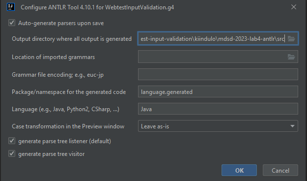

# Grammar Creation

Based on the [specification](WebTestInputValidationSpecification.md) of the language and the input [example code](https://github.com/MDSDLab/mdsd-2024-lab4-antlr/blob/main/src/examples/PersonForm.wtiv), create the grammar for the WebtestInputValidation language in the **language.WebtestInputValidation.g4** file of the starter project.

Before generating code (lexer, parser, visitor, etc.) from the grammar, right-click -> *Configure ANTLR...* and set it up as shown in the image below. After every change to the grammar (g4 file), you must regenerate these artifacts, similarly to the process seen in the Xtext lab tasks.

---
**Note**

You can test a grammar rule by right-clicking on the rule name and selecting *Test Rule XY*. It is advisable to use this feature frequently with parts of the input example code to ensure the correctness of the grammar!

---