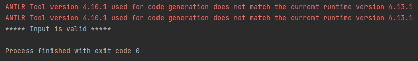

# Project Setup

## Installing Plugins
In the *File -> Settings -> Plugins* menu, install the ANTLR and, optionally, the StringTemplate plugins. These provide syntax highlighting and other useful editor functionalities for editing .g4 (ANTLR grammar) and .stg (StringTemplate group) files.

## Adding Dependencies
The project's *lib* folder already contains the ANTLR and StringTemplate dependencies in .jar format. Add them to the project dependencies via *File -> Project Structure... -> Modules -> Dependencies* ("+" button). Ensure they are correctly added!

---
**Note**

If you do not intend to use StringTemplate, you don't need to add it to the dependencies.

---

## Java SDK Version
The base project was created with Java SDK 17. If this is not suitable for some reason, you can change it under *File -> Project Structure...*.

## Running the Project
Run the **main** method in the **WebtestInputRunner** class, located in the **main** package! The code doesn't do anything significant yet, so we're just checking that it runs without errors. If successful, the console output should look similar to the following:

The red text indicates warnings caused by differences between the IntelliJ ANTLR plugin and the runtime version being used. This will not affect the lab tasks, so feel free to ignore them.