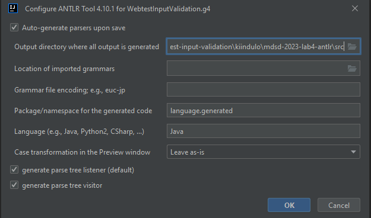

# A nyelvtan elkészítése

A nyelv [specifikációja](WebTestInputValidationSpecification.md) és a bemeneti [példakód](https://github.com/MDSDLab/mdsd-2024-lab4-antlr/blob/main/src/examples/PersonForm.wtiv) alapján készítsétek el a WebtestInputValidation nyelv nyelvtanát a kiinduló projekt **language.WebtestInputValidation.g4** fájlban!

Mielőtt a nyelvtanból kódot (lexer, parser, visitor, stb.) generáltok (jobb klikk -> *Generate ANTLR Recognizer*), előtte jobb klikk -> *Configure ANTLR...* -> az alábbi ábrához hasonló módon állítsátok be. Minden, nyelvtan (g4 fájl) változtatás után - az Xtext-hez hasonlóan - újra kell generálni ezeket az artifact-okat.

---
**Megjegyzés**

Nyelvtan szabályt a szabály nevén jobb klikk -> *Test Rule XY* menüpont alatt lehet tesztelni. Ezt érdemes gyakran használni a bemeneti példakód részleteivel, hogy meggyőződhessetek a nyelvtan helyességéről!

---