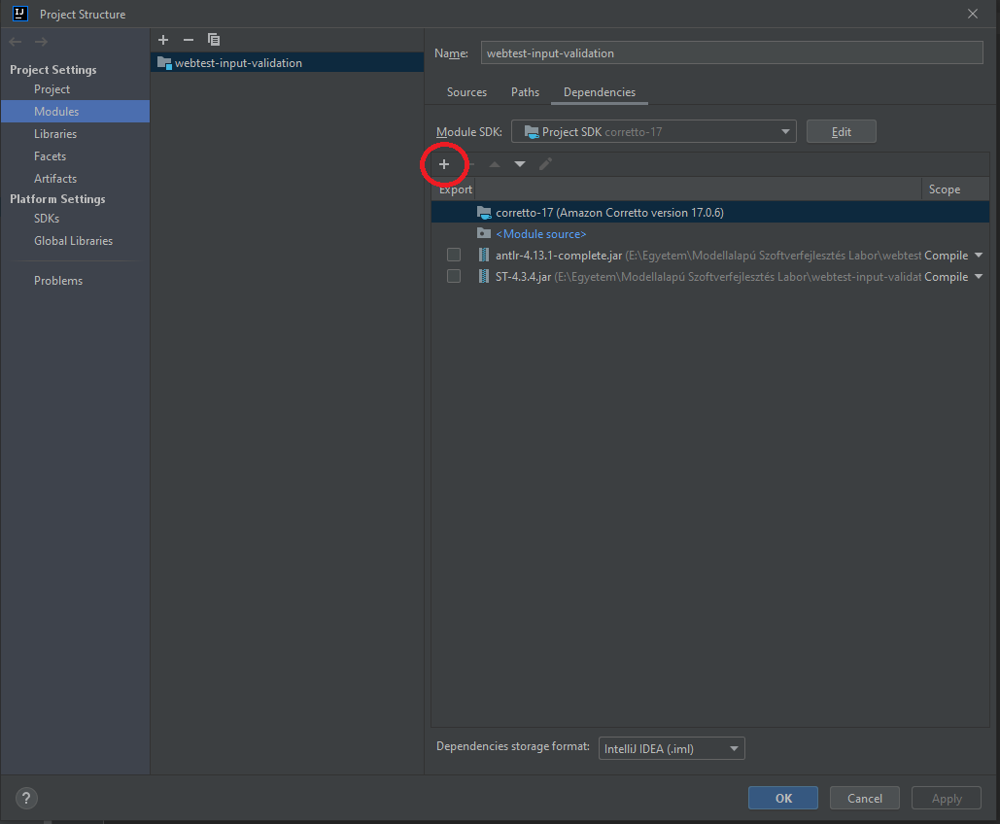

# A projekt előkészítése

## Pluginok telepítése
A *File -> Settings -> Plugins* menüpont alatt telepítsük fel az ANTLR és - opcionálisan, amennyiben használjátok - a StringTemplate pluginokat. Ezek szintaxis kiemelés és egyéb hasznos szerkesztő funkciókkal támogatják a .g4 (ANTLR nyelvtan) és .stg (StringTemplate group) fájlok szerkesztését.

## Függőségek hozzáadása
A projekt *lib* mappájába már le vannak töltve az ANTLR és StringTemplate dependenciák .jar formátumban. Előfordulhat, hogy ezeket a *File -> Project Structure... -> Modules -> Dependencies* alatt fel kell venni a projekt függőségei közé ("+" gomb). Győződjünk meg róla, hogy fel vannak véve!

---
**Megjegyzés**

Ha nem használjátok a StringTemplate-et, természetesen nem kell felvenni a függőségek közé.

---

## Java SDK verzió
A kiinduló projekt egy Java 17-es SDK-val készült. Ha ez valamiért nem lenne megfelelő, a *File -> Project Structure...* menüpont alatt átállítható.

## Futtatás
Futtassuk le a **main** package-ben található **WebtestInputRunner** osztály main metódusát! A kód még nem csinál semmi érdemlegeset, ezért csak azt ellenőrizzük, hogy hiba nélkül lefutott-e. Ha igen, az alábbihoz hasonlót kell kapnunk a konzolon:

A piros szöveg warningokat tartalmaz, amik az IntelliJ ANTLR plugin és a használt runtime verziója közötti különbségből erednek. Ez nem fogja befolyásolni a laborfeladatokat, figyelmen kívül hagyhatók.
