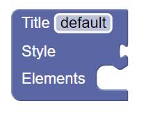

# The start project

You can test the start project by running the *index.html* file. On the left side of the screen you can find the Blockly modeling toolkit, while on the right, there are components related to code generation. 

## The initial language

The initial language contains a single element (WebPage) that represents the website itself:

This element illustrates all three common ways to specify data fields in Blockly:
* The **Title** field is a primitive literal value, typically a text or number
* Elements can be inserted into the **Style** field, similar to puzzle pieces, a typical example for this is passing the parameter in a function call
* The **Elements** field can contain multiple instructions one below the other, a typical example is a list of instructions to execute inside a loop

As you can see, both the Style and Elements fields connect two elements of the language, but the semantics are fundamentally different. The method used in Style is useful for expression-like constructs, while the method used in Elements is useful for statement-like constructs. For simplicity, in the specification of the language, we always specify where value-based (see Style) relationship should be used. 

## Language processing

Language processing means basically code generation here. In the given example, we have implemented a very simple solution for this. The *Generate code* button generates the code for the blocks in the editor. For ease of use and troubleshooting, it is possible to view the code itself or the "rendered" web page by switching between tabs. The example also allows you to save/download the generated .html code using the *Download HTML* button. During the development of the lab, the functionality of the buttons does not need to be supplemented, only the code fragments belonging to each block need to be entered in the appropriate way. 

We've provided a simple template for WebPage so that code generation can be tested. The template also generates text (*Generated page*) for the web page, which of course should be removed from the template later. 

Based on this example, the task is to implement the [required](controls.md) parts and the [extension](extensions.md).

