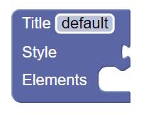

# A kezdőprojekt áttekintése

A kezdőprojekt az *index.html* fájl futtatásával próbálható ki. A képernyő bal oldalán a Blockly modellező eszköztár található, míg a jobb oldalon a kódgeneráláshoz kapcsolódó komponensek. 

## A kezdeti nyelv

A kezdeti nyelv egyetlen elemet (WebPage) tartalmaz, ami magát a honlapot reprezentálja:

Az elem a Blocklyban szokásos mindhárom adatmegadási módot illusztrálja:
* A **Title** mezőbe egy primitív literál jellegű értéket lehet megadni, ami tipikusan egy szöveg, vagy szám
* A **Style** mezőbe egy másik elemet lehet beilleszteni a kirakósdarabokhoz hasonlóan, tipikus példa egy függvényhívásnál a paraméter átadása
* Az **Elements** mezőbe több utasítást is fel lehet venni egymás alá, tipikus példa egy ciklus belsejében végrehajtandó utasítások listája

Ahogy látható, a Style és az Elements mező esetén is a nyelv két eleme közt teremtünk kapcsolatot, de alapvetően eltér a szemantika. A Style-nál használt módszer az expression jellegű konstrukcióknál, míg az Elementsnél használt módszer a statement jellegű konstrukcióknál hasznos. Az egyszerűség kedvéért a nyelv specifikációjában a labor során mindig megadjuk, ahol érték alapú (l. Style) kapcsolatot kell használni. 

## A nyelv feldolgozása

A nyelv feldolgozása gyakorlatilag a kódgenerálást jelenti. A kiadott példában erre is adunk egy nagyon egyszerű megoldást. A *Generate code* gomb legenerálja az editorban szereplő blokkokhoz tartozó kódot. Az egyszerűbb használat és hibakeresés érdekében lehetőség van magát a kódot, ill. a "lerenderelt" weboldalt is megtekinteni a tabok közti váltással. A példa lehetővé teszi a generált .html kód kimentését/letöltését is a *Download HTML* gomb segítségével. A labor kidolgozása során a gombok funkcionalitását nem kell kiegészíteni, csak az egyes blokkokhoz tartozó kódrészleteket kell a megfelelő módon megadni. 

A WebPage elemhez megadtunk egy egyszerű sablont, hogy a kódgenerálás kipróbálható legyen. A sablon egy szöveget (*Generated page*) is belegenerál a weboldalra, ez természetesen a későbbiek során eltávolítandó a sablonból. 

A példa alapján a feladat a [kötelező](controls.md) részek, valamint a [kijelölt](ExtensionsTable.md) [bővítmény](extensions.md) megvalósítása.
